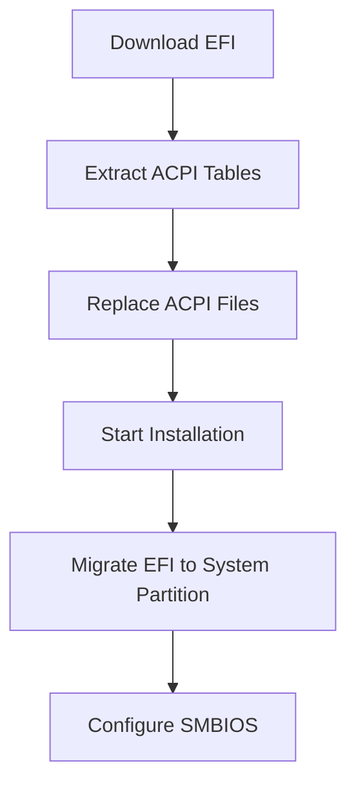

<div align="center">
  
  
  <h1>Run macOS Perfectly on Windows Laptop</h1>
  <small>
    <a href="README.md">简体中文</a> |
    <a href="README_繁體中文.md">繁體中文</a> | 
    <strong>English</strong> 
  </small>
  <p>Custom Hackintosh solution for ASUS VivoBook FL8700JP (X509JP)</p>
  
  <div>
    
    
    
  </div>
</div>

---

## 📚 Table of Contents

1. [🖥 Project Structure](#-project-structure)
2. [💻 Hardware Support](#-hardware-support)
3. [🖥️ System Compatibility](#️-system-compatibility)
4. [⚙️ Installation Guide](#️-installation-guide)
5. [🛠️ Advanced Configuration](#️-advanced-configuration)
6. [❓ Frequently Asked Questions](#-frequently-asked-questions)
7. [⚠️ Important Notes](#️-important-notes)
8. [🤝 Contribution](#-contribution)

---

## 🖥 Project Structure

### EFI Configuration Structure

```bash
EFI/
├── BOOT/
│   └── BOOTx64.efi              # Bootloader
└── OC/
    ├── ACPI/                    # System patches and fixes
    │   ├── SSDT-AWAC.aml        # Clock controller fix
    │   ├── SSDT-EC-USBX.aml     # Embedded controller
    │   └── SSDT-PLUG.aml        # CPU power management
    ├── Kexts/                   # Core hardware drivers
    │   ├── Lilu.kext            # Core plugin
    │   ├── VirtualSMC.kext      # System management controller
    │   ├── WhateverGreen.kext   # Graphics fix
    │   └── AppleALC.kext        # Audio driver
    ├── Drivers/                 # OpenCore boot drivers
    │   ├── OpenRuntime.efi      # Runtime services
    │   └── HfsPlus.efi          # HFS+ filesystem support
    ├── config.plist             # Main configuration file
    └── Tools/                   # Utility collection
```

### ⚠️ Important Notes

- **Model Specific**: Only for ASUS FL8700JP (X509JP)  
- **System Preparation**: Requires macOS installation image  
- **Risk Warning**: Backup important data before operation  
- **License**: Follow [MIT License](LICENSE), commercial use prohibited  

---

## 📸 Screenshots

<div align="center">
  
  
</div>

---

## 💻 Hardware Support

| Component        | Model                      | Status       | Details                  |
|------------------|----------------------------|--------------|--------------------------|
| **CPU**          | Intel i7-1065G7           | ✅ Perfect    | Ice Lake optimization   |
| **iGPU**         | Intel Iris Plus G7        | ⚠️ Basic      | No HDMI output          |
| **dGPU**         | NVIDIA MX330              | ❌ Not supported | Disabled in config      |
| **Audio**        | Realtek ALC256            | ✅ Perfect    | Auto input/output switch|
| **WiFi**         | Intel Wireless-AC 9461    | ⚠️ Partial    | No AirDrop support      |
| **Trackpad**     | ELAN1200                  | ⚠️ Basic      | Occasionally unresponsive |
| **Type-C**       | -                         | ⚠️ Partial    | No video output         |
| **Bluetooth**    | Intel Bluetooth           | ✅ Perfect    | Full functionality      |

---

## 🖥️ System Compatibility

| macOS Version   | Compatibility | Minimum Version |
|-----------------|---------------|-----------------|
| **Catalina**    | ✅ Perfect     | 10.15.4         |
| **Big Sur**     | ✅ Perfect     | 11.0            |
| **Monterey**    | ✅ Perfect     | 12.0            |
| **Ventura**     | ✅ Perfect     | 13.0            |
| **Sonoma**      | ✅ Perfect     | 14.0            |
| **Sequoia**     | ✅ Perfect     | 15.0            |

---

## ⚙️ Installation Guide

### Preparation

1. **BIOS Settings**:
   - Disable Secure Boot
   - Disable Fast Boot
   - Set DVMT Pre-Alloc to 64M

2. **Installation Media**:
   - Download macOS image (recommended [Daliansky Blog](https://blog.daliansky.net/))
   - Use [BalenaEtcher](https://www.balena.io/etcher/) to create bootable USB

### Installation Process



### Detailed Steps

1. **Download Project Files**  
   Visit [Releases Page](https://github.com/bilijp153/ASUS-VivoBook-FL8700JP-Hackintosh/releases) to download latest EFI

2. **Extract Local ACPI Tables**  
   ```bash
   # Use SSDTTime to extract necessary files
   SSDTTime extract → FACP.aml → Rename to SSDT-FACP.aml
   ```

3. **Replace Configuration Files**  
   Place generated SSDT files in `EFI/OC/ACPI` directory

4. **Start Installation**  
   - Boot from USB into OpenCore
   - Select "Install macOS XXX"
   - Follow on-screen instructions

5. **Migrate EFI**  
   After installation, use [MountEFI](https://github.com/corpnewt/MountEFI) to migrate EFI to system partition

6. **SMBIOS Configuration**  
   ```bash
   1. Use OCAuxiliaryTools to edit config.plist
   2. Set model to MacBookPro16,2
   3. Generate serials and validate
   ```

---

## 🛠️ Advanced Configuration

### Dual Boot Installation (BootCamp)


1. Get BootCamp support files from [brigadier](https://github.com/corpnewt/brigadier)
2. Copy generated BootCamp folder to Windows system drive
3. Modify config.plist:
   ```xml
   <key>PlatformInfo</key>
   <dict>
     <key>updateSMBIOSMode</key>
     <string>Create</string>
   </dict>
   ```
4. Reboot into Windows and install BootCamp
5. After completion, restore updateSMBIOSMode to `Custom`

---

## ❓ Frequently Asked Questions

<details>
<summary><strong>Q: How to disable the startup chime sound?</strong></summary>
<p>Go to "System Settings" → "Sound" → Uncheck "Play sound on startup"</p>
</details>

<details>
<summary><strong>Q: Trackpad occasionally unresponsive?</strong></summary>
<p>This is a known issue with ELAN1200 driver, temporary solutions:</p>
<ul>
  <li>Reboot system</li>
  <li>Wake from sleep mode</li>
</ul>
</details>

<details>
<summary><strong>Q: How to change default boot system?</strong></summary>
<p>Two methods:</p>
<ol>
  <li>Press <code>Ctrl+Enter</code> at OpenCore boot screen</li>
  <li>In macOS: "System Settings" → "Startup Disk"</li>
</ol>
</details>

<details>
<summary><strong>Q: Bluetooth devices won't connect?</strong></summary>
<p>Try these solutions:</p>
<ul>
  <li>Check if Bluetooth is properly driven</li>
  <li>Update to latest EFI</li>
  <li>Check if it's a device issue</li>
</ul>
</details>

---

## ⚠️ Important Notes

1. **Initial Setup**  
   Skip Apple ID login during initialization, log in after completing system setup

2. **Serial Validation**  
   Serial should show "Invalid Serial Number" on [Apple Coverage Check](https://checkcoverage.apple.com/)

3. **Secure Login**  
   Only log in to your Apple ID after completing the above steps

4. **System Updates**  
   Before updating macOS:
   - Backup current EFI partition
   - Check project update logs
   - Wait for community compatibility confirmation

---

## 🤝 Contribution

### Core Team

| Role         | Contributor                   | Contact                |
|--------------|-------------------------------|------------------------|
| Maintainer   | [极光呆呆脑](https://github.com/bilijp153) | 1551656605@qq.com      |
| Tester       | [若涵](https://github.com/catlingyun)    | - |

### Feedback Channels
- [Submit Issue](https://github.com/bilijp153/ASUS-VivoBook-FL8700JP-Hackintosh/issues)
- Email: 1551656605@qq.com

---

## 🙏 Special Thanks

- [OpenCore Install Guide](https://dortania.github.io/OpenCore-Install-Guide/) - Gold standard for Hackintosh
- [Acidanthera](https://github.com/acidanthera) - Core driver development
- [laobamac](https://github.com/laobamac) - OCLP-Mod developer
- [Dortania Community](https://dortania.github.io) - Technical support and knowledge base
- [Daliansky](https://blog.daliansky.net/) - Quality installation images

---

<div align="center">
  
📜 **License**: [MIT](LICENSE)  
© 2021-2025 Jiguang Daidai Nao - All rights reserved

> **Note**: This project is for educational purposes only. Use macOS in compliance with Apple's terms.

</div>
