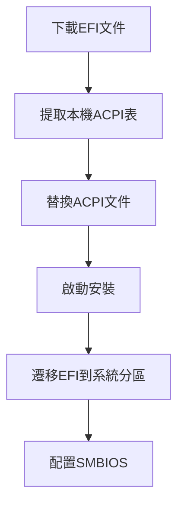
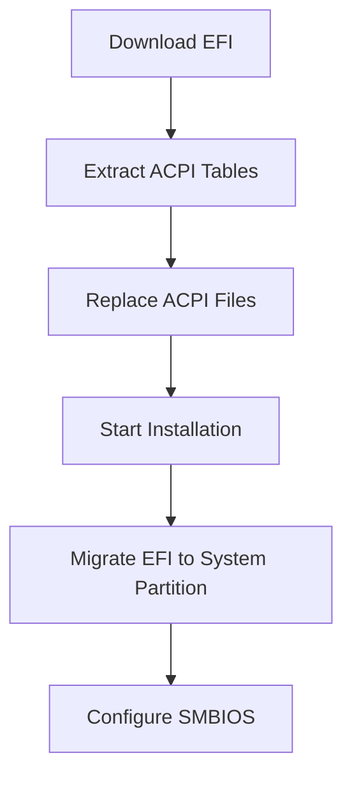

<div align="right">
  <small>
    <a href="README.md>简体中文</a> | 
    <strong>繁體中文</strong> | 
    <a href="README_en.md">English</a>
  </small>
</div>

<div align="center">
  
  
  <h1>讓 Windows 筆記本完美運行 macOS</h1>
  <p>為華碩 VivoBook FL8700JP (X509JP) 定制的黑蘋果解決方案</p>
  
  <div>
    
    
    
  </div>
</div>

---

## 📚 目錄導航

1. [🖥 項目結構](#-項目結構)
2. [💻 硬體支援](#-硬體支援)
3. [🖥️ 系統兼容](#️-系統兼容)
4. [⚙️ 安裝指南](#️-安裝指南)
5. [🛠️ 高級配置](#️-高級配置)
6. [❓ 常見問題](#-常見問題)
7. [⚠️ 重要提示](#️-重要提示)
8. [🤝 參與貢獻](#-參與貢獻)

---

## 🖥 項目結構

### EFI 配置文件結構

```bash
EFI/
├── BOOT/
│   └── BOOTx64.efi              # 引導文件
└── OC/
    ├── ACPI/                    # 系統補丁與修復
    │   ├── SSDT-AWAC.aml        # 時鐘控制器修復
    │   ├── SSDT-EC-USBX.aml     # 嵌入式控制器
    │   └── SSDT-PLUG.aml        # CPU電源管理
    ├── Kexts/                   # 核心硬體驅動
    │   ├── Lilu.kext            # 核心插件
    │   ├── VirtualSMC.kext      # 系統管理控制器
    │   ├── WhateverGreen.kext   # 顯卡修復
    │   └── AppleALC.kext        # 聲卡驅動
    ├── Drivers/                 # OpenCore 引導驅動
    │   ├── OpenRuntime.efi      # 運行時服務
    │   └── HfsPlus.efi          # HFS+文件系統支持
    ├── config.plist             # 主配置文件
    └── Tools/                   # 實用工具集合
```

### ⚠️ 重要說明

- **專屬適配**：僅適用於華碩 FL8700JP (X509JP) 特定機型  
- **系統準備**：需自行取得 macOS 安裝映像  
- **風險提示**：操作前請務必備份重要資料  
- **授權許可**：遵循 [MIT 許可證](LICENSE)，禁止商業用途  

---

## 📸 效果展示

<div align="center">
  
  
</div>

---

## 💻 硬體支援

| 組件         | 型號                      | 狀態       | 詳細說明               |
|--------------|---------------------------|------------|------------------------|
| **處理器**   | Intel i7-1065G7           | ✅ 完美支援 | Ice Lake 架構優化     |
| **內顯**     | Intel Iris Plus G7        | ⚠️ 基本支援 | 不支援 HDMI 輸出      |
| **獨立顯卡** | NVIDIA MX330              | ❌ 不支援   | 已在配置中屏蔽        |
| **音訊**     | Realtek ALC256            | ✅ 完美支援 | 自動切換輸入/輸出設備 |
| **無線網路** | Intel Wireless-AC 9461    | ⚠️ 部分支援 | 不支援隔空投放       |
| **觸控板**   | ELAN1200                  | ⚠️ 基本支援 | 偶發無響應            |
| **Type-C**   | -                         | ⚠️ 部分支援 | 不支援視頻輸出        |
| **藍牙**     | Intel Bluetooth           | ✅ 完美支援 | 完整功能              |

---

## 🖥️ 系統兼容

| macOS 版本   | 兼容狀態 | 最低要求版本 |
|--------------|----------|--------------|
| **Catalina** | ✅ 完美  | 10.15.4      |
| **Big Sur**  | ✅ 完美  | 11.0         |
| **Monterey** | ✅ 完美  | 12.0         |
| **Ventura**  | ✅ 完美  | 13.0         |
| **Sonoma**   | ✅ 完美  | 14.0         |
| **Sequoia**  | ✅ 完美  | 15.0         |

---

## ⚙️ 安裝指南

### 準備工作

1. **BIOS 設定**：
   - 停用 Secure Boot
   - 關閉 Fast Boot
   - 設定 DVMT 預分配為 64M

2. **安裝媒體**：
   - 下載 macOS 映像（推薦[黑果小兵的部落閣](https://blog.daliansky.net/)）
   - 使用 [BalenaEtcher](https://www.balena.io/etcher/) 建立安裝USB

### 安裝流程



### 詳細步驟

1. **下載項目文件**  
   訪問 [發布頁面](https://github.com/bilijp153/ASUS-VivoBook-FL8700JP-Hackintosh/releases) 下載最新EFI

2. **提取本機 ACPI 表**  
   ```bash
   # 使用 SSDTTime 提取必要文件
   SSDTTime 提取 → FACP.aml → 重命名為 SSDT-FACP.aml
   ```

3. **替換配置文件**  
   將生成的SSDT文件放入 `EFI/OC/ACPI` 目錄

4. **啟動安裝**  
   - 從USB啟動進入 OpenCore
   - 選擇 "Install macOS XXX"
   - 按照螢幕提示完成安裝

5. **遷移 EFI**  
   安裝完成後，使用 [MountEFI](https://github.com/corpnewt/MountEFI) 工具將EFI遷移到系統分區

6. **SMBIOS 配置**  
   ```bash
   1. 使用 OCAuxiliaryTools 編輯 config.plist
   2. 設定機型為 MacBookPro16,2
   3. 生成三碼並驗證
   ```

---

## 🛠️ 高級配置

### 雙系統安裝 (BootCamp)


1. 從 [brigadier](https://github.com/corpnewt/brigadier) 獲取 BootCamp 支援文件
2. 將生成的 BootCamp 文件夾複製到 Windows 系統盤
3. 修改 config.plist:
   ```xml
   <key>PlatformInfo</key>
   <dict>
     <key>updateSMBIOSMode</key>
     <string>Create</string>
   </dict>
   ```
4. 重啟進入 Windows 並安裝 BootCamp
5. 完成後恢復 updateSMBIOSMode 為 `Custom`

---

## ❓ 常見問題

<details>
<summary><strong>Q: 如何關閉開機時的"咚"聲？</strong></summary>
<p>前往"系統設定" → "聲音" → 取消勾選"啟動時播放聲音"</p>
</details>

<details>
<summary><strong>Q: 觸控板偶爾無響應怎麼辦？</strong></summary>
<p>這是 ELAN1200 驅動的已知問題，暫時可通過以下方法解決：</p>
<ul>
  <li>重啟系統</li>
  <li>進入睡眠模式後喚醒</li>
</ul>
</details>

<details>
<summary><strong>Q: 如何更改默認啟動系統？</strong></summary>
<p>兩種方法：</p>
<ol>
  <li>在 OpenCore 啟動界面按 <code>Ctrl+Enter</code> 設置默認啟動項</li>
  <li>進入 macOS 後通過"系統設定" → "啟動磁盤"設置</li>
</ol>
</details>

<details>
<summary><strong>Q: 藍牙設備無法連接？</strong></summary>
<p>嘗試以下解決方案：</p>
<ul>
  <li>檢查藍牙是否正常驅動</li>
  <li>更新新版本EFI</li>
  <li>檢查是否為設備問題</li>
</ul>
</details>

---

## ⚠️ 重要提示

1. **首次設置**  
   在初始化界面跳過 Apple ID 登錄，完成系統設定後再登錄

2. **三碼驗證**  
   序號在 [Apple 官網](https://checkcoverage.apple.com/) 應顯示"無效序號"狀態

3. **安全登錄**  
   完成上述步驟後再登錄您的 Apple ID，避免賬戶異常

4. **系統更新**  
   每次進行 macOS 系統更新前：
   - 備份當前 EFI 分區
   - 檢查項目更新日誌
   - 等待社區確認兼容性

---

## 🤝 參與貢獻

### 核心團隊

| 角色       | 貢獻者                     | 聯繫方式                |
|------------|----------------------------|-------------------------|
| 項目維護   | [極光呆呆腦](https://github.com/bilijp153) | 1551656605@qq.com      |
| 測試驗證   | [若涵](https://github.com/catlingyun)    | - |

### 反饋渠道
- [提交 Issue](https://github.com/bilijp153/ASUS-VivoBook-FL8700JP-Hackintosh/issues)
- 發送郵件至: 1551656605@qq.com

---

## 🙏 特別鳴謝

- [OpenCore 官方指南](https://dortania.github.io/OpenCore-Install-Guide/) - 黑蘋果安裝的黃金標準
- [Acidanthera](https://github.com/acidanthera) - 提供核心驅動開發
- [laobamac](https://github.com/laobamac) - OCLP-Mod 開發者
- [Dortania 社區](https://dortania.github.io) - 技術支持與知識庫
- [黑果小兵](https://blog.daliansky.net/) - 優質安裝映像資源

---

<div align="center">
  
📜 **許可證**: [MIT](LICENSE)  
© 2021-2025 極光呆呆腦 - 保留所有權利

> **溫馨提示**：本項目僅用於學習和研究目的，使用 macOS 請遵守蘋果公司相關協議

</div>

---

<a id="english-version"></a>
# 🍎 ASUS VivoBook FL8700JP Hackintosh Project (English Version)

<div align="right">
  <small>
    <strong>English</strong> | 
    <a href="#繁體中文版">繁體中文</a> | 
    <a href="#-华硕-vivobook-fl8700jp-黑苹果项目">简体中文</a>
  </small>
</div>

<div align="center">
  
  
  <h1>Run macOS Perfectly on Windows Laptop</h1>
  <p>Custom Hackintosh solution for ASUS VivoBook FL8700JP (X509JP)</p>
  
  <div>
    
    
    
  </div>
</div>

---

## 📚 Table of Contents

1. [🖥 Project Structure](#-project-structure)
2. [💻 Hardware Support](#-hardware-support)
3. [🖥️ System Compatibility](#️-system-compatibility)
4. [⚙️ Installation Guide](#️-installation-guide)
5. [🛠️ Advanced Configuration](#️-advanced-configuration)
6. [❓ Frequently Asked Questions](#-frequently-asked-questions)
7. [⚠️ Important Notes](#️-important-notes)
8. [🤝 Contribution](#-contribution)

---

## 🖥 Project Structure

### EFI Configuration Structure

```bash
EFI/
├── BOOT/
│   └── BOOTx64.efi              # Bootloader
└── OC/
    ├── ACPI/                    # System patches and fixes
    │   ├── SSDT-AWAC.aml        # Clock controller fix
    │   ├── SSDT-EC-USBX.aml     # Embedded controller
    │   └── SSDT-PLUG.aml        # CPU power management
    ├── Kexts/                   # Core hardware drivers
    │   ├── Lilu.kext            # Core plugin
    │   ├── VirtualSMC.kext      # System management controller
    │   ├── WhateverGreen.kext   # Graphics fix
    │   └── AppleALC.kext        # Audio driver
    ├── Drivers/                 # OpenCore boot drivers
    │   ├── OpenRuntime.efi      # Runtime services
    │   └── HfsPlus.efi          # HFS+ filesystem support
    ├── config.plist             # Main configuration file
    └── Tools/                   # Utility collection
```

### ⚠️ Important Notes

- **Model Specific**: Only for ASUS FL8700JP (X509JP)  
- **System Preparation**: Requires macOS installation image  
- **Risk Warning**: Backup important data before operation  
- **License**: Follow [MIT License](LICENSE), commercial use prohibited  

---

## 📸 Screenshots

<div align="center">
  
  
</div>

---

## 💻 Hardware Support

| Component        | Model                      | Status       | Details                  |
|------------------|----------------------------|--------------|--------------------------|
| **CPU**          | Intel i7-1065G7           | ✅ Perfect    | Ice Lake optimization   |
| **iGPU**         | Intel Iris Plus G7        | ⚠️ Basic      | No HDMI output          |
| **dGPU**         | NVIDIA MX330              | ❌ Not supported | Disabled in config      |
| **Audio**        | Realtek ALC256            | ✅ Perfect    | Auto input/output switch|
| **WiFi**         | Intel Wireless-AC 9461    | ⚠️ Partial    | No AirDrop support      |
| **Trackpad**     | ELAN1200                  | ⚠️ Basic      | Occasionally unresponsive |
| **Type-C**       | -                         | ⚠️ Partial    | No video output         |
| **Bluetooth**    | Intel Bluetooth           | ✅ Perfect    | Full functionality      |

---

## 🖥️ System Compatibility

| macOS Version   | Compatibility | Minimum Version |
|-----------------|---------------|-----------------|
| **Catalina**    | ✅ Perfect     | 10.15.4         |
| **Big Sur**     | ✅ Perfect     | 11.0            |
| **Monterey**    | ✅ Perfect     | 12.0            |
| **Ventura**     | ✅ Perfect     | 13.0            |
| **Sonoma**      | ✅ Perfect     | 14.0            |
| **Sequoia**     | ✅ Perfect     | 15.0            |

---

## ⚙️ Installation Guide

### Preparation

1. **BIOS Settings**:
   - Disable Secure Boot
   - Disable Fast Boot
   - Set DVMT Pre-Alloc to 64M

2. **Installation Media**:
   - Download macOS image (recommended [Daliansky Blog](https://blog.daliansky.net/))
   - Use [BalenaEtcher](https://www.balena.io/etcher/) to create bootable USB

### Installation Process



### Detailed Steps

1. **Download Project Files**  
   Visit [Releases Page](https://github.com/bilijp153/ASUS-VivoBook-FL8700JP-Hackintosh/releases) to download latest EFI

2. **Extract Local ACPI Tables**  
   ```bash
   # Use SSDTTime to extract necessary files
   SSDTTime extract → FACP.aml → Rename to SSDT-FACP.aml
   ```

3. **Replace Configuration Files**  
   Place generated SSDT files in `EFI/OC/ACPI` directory

4. **Start Installation**  
   - Boot from USB into OpenCore
   - Select "Install macOS XXX"
   - Follow on-screen instructions

5. **Migrate EFI**  
   After installation, use [MountEFI](https://github.com/corpnewt/MountEFI) to migrate EFI to system partition

6. **SMBIOS Configuration**  
   ```bash
   1. Use OCAuxiliaryTools to edit config.plist
   2. Set model to MacBookPro16,2
   3. Generate serials and validate
   ```

---

## 🛠️ Advanced Configuration

### Dual Boot Installation (BootCamp)


1. Get BootCamp support files from [brigadier](https://github.com/corpnewt/brigadier)
2. Copy generated BootCamp folder to Windows system drive
3. Modify config.plist:
   ```xml
   <key>PlatformInfo</key>
   <dict>
     <key>updateSMBIOSMode</key>
     <string>Create</string>
   </dict>
   ```
4. Reboot into Windows and install BootCamp
5. After completion, restore updateSMBIOSMode to `Custom`

---

## ❓ Frequently Asked Questions

<details>
<summary><strong>Q: How to disable the startup chime sound?</strong></summary>
<p>Go to "System Settings" → "Sound" → Uncheck "Play sound on startup"</p>
</details>

<details>
<summary><strong>Q: Trackpad occasionally unresponsive?</strong></summary>
<p>This is a known issue with ELAN1200 driver, temporary solutions:</p>
<ul>
  <li>Reboot system</li>
  <li>Wake from sleep mode</li>
</ul>
</details>

<details>
<summary><strong>Q: How to change default boot system?</strong></summary>
<p>Two methods:</p>
<ol>
  <li>Press <code>Ctrl+Enter</code> at OpenCore boot screen</li>
  <li>In macOS: "System Settings" → "Startup Disk"</li>
</ol>
</details>

<details>
<summary><strong>Q: Bluetooth devices won't connect?</strong></summary>
<p>Try these solutions:</p>
<ul>
  <li>Check if Bluetooth is properly driven</li>
  <li>Update to latest EFI</li>
  <li>Check if it's a device issue</li>
</ul>
</details>

---

## ⚠️ Important Notes

1. **Initial Setup**  
   Skip Apple ID login during initialization, log in after completing system setup

2. **Serial Validation**  
   Serial should show "Invalid Serial Number" on [Apple Coverage Check](https://checkcoverage.apple.com/)

3. **Secure Login**  
   Only log in to your Apple ID after completing the above steps

4. **System Updates**  
   Before updating macOS:
   - Backup current EFI partition
   - Check project update logs
   - Wait for community compatibility confirmation

---

## 🤝 Contribution

### Core Team

| Role         | Contributor                   | Contact                |
|--------------|-------------------------------|------------------------|
| Maintainer   | [极光呆呆脑](https://github.com/bilijp153) | 1551656605@qq.com      |
| Tester       | [若涵](https://github.com/catlingyun)    | - |

### Feedback Channels
- [Submit Issue](https://github.com/bilijp153/ASUS-VivoBook-FL8700JP-Hackintosh/issues)
- Email: 1551656605@qq.com

---

## 🙏 Special Thanks

- [OpenCore Install Guide](https://dortania.github.io/OpenCore-Install-Guide/) - Gold standard for Hackintosh
- [Acidanthera](https://github.com/acidanthera) - Core driver development
- [laobamac](https://github.com/laobamac) - OCLP-Mod developer
- [Dortania Community](https://dortania.github.io) - Technical support and knowledge base
- [Daliansky](https://blog.daliansky.net/) - Quality installation images

---

<div align="center">
  
📜 **License**: [MIT](LICENSE)  
© 2021-2025 Jiguang Daidai Nao - All rights reserved

> **Note**: This project is for educational purposes only. Use macOS in compliance with Apple's terms.

</div>
