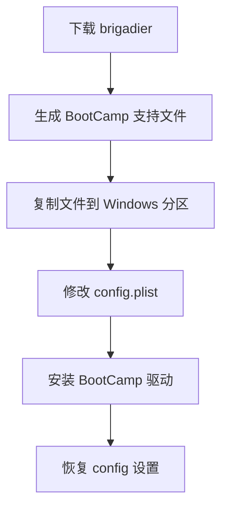

# 华硕 VivoBook FL8700JP 黑苹果项目

<div align="center">
  
  
  
  <h1 style="font-size: 2.5rem; margin: 20px 0 10px; background: linear-gradient(90deg, #6a11cb 0%, #2575fc 100%); -webkit-background-clip: text; -webkit-text-fill-color: transparent;">让 Windows 笔记本完美运行 macOS</h1>
  <p style="font-size: 1.2rem; color: #6c757d; max-width: 800px; margin: 0 auto;">为华硕 VivoBook FL8700JP (X509JP) 定制的专业级黑苹果解决方案</p>
  
  <div style="display: flex; justify-content: center; gap: 15px; margin: 20px 0;">
    
    
    
  </div>
  
  <div style="display: flex; justify-content: center; gap: 10px; margin-bottom: 30px;">
    <a href="#️-安装指南" style="text-decoration: none;">
      <button style="background: linear-gradient(135deg, #6a11cb 0%, #2575fc 100%); color: white; border: none; padding: 12px 25px; border-radius: 30px; font-size: 1rem; cursor: pointer; transition: all 0.3s ease; box-shadow: 0 4px 15px rgba(37, 117, 252, 0.3);">立即安装</button>
    </a>
    <a href="https://github.com/bilijp153/ASUS-VivoBook-FL8700JP-Hackintosh/releases" style="text-decoration: none;">
      <button style="background: linear-gradient(135deg, #11998e 0%, #38ef7d 100%); color: white; border: none; padding: 12px 25px; border-radius: 30px; font-size: 1rem; cursor: pointer; transition: all 0.3s ease; box-shadow: 0 4px 15px rgba(17, 153, 142, 0.3);">下载 EFI</button>
    </a>
  </div>
</div>

---

## 🧭 快速导航
<div class="nav-grid" style="display: grid; grid-template-columns: repeat(auto-fit, minmax(250px, 1fr)); gap: 15px; margin: 30px 0;">
  <a href="#-核心优势" style="text-decoration: none; color: inherit;">
    <div style="background: linear-gradient(135deg, #6a11cb 0%, #2575fc 100%); padding: 20px; border-radius: 12px; color: white; transition: transform 0.3s ease;">
      <h3 style="margin: 0 0 10px; display: flex; align-items: center; gap: 10px;">🌟 核心优势</h3>
      <p style="margin: 0; opacity: 0.9;">探索项目独特优势</p>
    </div>
  </a>
  
  <a href="#-效果展示" style="text-decoration: none; color: inherit;">
    <div style="background: linear-gradient(135deg, #11998e 0%, #38ef7d 100%); padding: 20px; border-radius: 12px; color: white; transition: transform 0.3s ease;">
      <h3 style="margin: 0 0 10px; display: flex; align-items: center; gap: 10px;">📸 效果展示</h3>
      <p style="margin: 0; opacity: 0.9;">查看实机运行效果</p>
    </div>
  </a>
  
  <a href="#-硬件支持" style="text-decoration: none; color: inherit;">
    <div style="background: linear-gradient(135deg, #ff416c 0%, #ff4b2b 100%); padding: 20px; border-radius: 12px; color: white; transition: transform 0.3s ease;">
      <h3 style="margin: 0 0 10px; display: flex; align-items: center; gap: 10px;">💻 硬件支持</h3>
      <p style="margin: 0; opacity: 0.9;">硬件兼容性详情</p>
    </div>
  </a>
  
  <a href="#️-安装指南" style="text-decoration: none; color: inherit;">
    <div style="background: linear-gradient(135deg, #654ea3 0%, #da98b4 100%); padding: 20px; border-radius: 12px; color: white; transition: transform 0.3s ease;">
      <h3 style="margin: 0 0 10px; display: flex; align-items: center; gap: 10px;">⚙️ 安装指南</h3>
      <p style="margin: 0; opacity: 0.9;">详细安装步骤</p>
    </div>
  </a>
</div>

---

## ✨ 核心优势
<div class="features" style="display: grid; grid-template-columns: repeat(auto-fit, minmax(300px, 1fr)); gap: 25px; margin: 40px 0;">
  <div style="background: #f8f9fa; border-radius: 12px; padding: 25px; box-shadow: 0 5px 15px rgba(0,0,0,0.05); transition: transform 0.3s ease;">
    <div style="display: flex; align-items: center; gap: 15px; margin-bottom: 15px;">
      <div style="width: 50px; height: 50px; background: linear-gradient(135deg, #6a11cb 0%, #2575fc 100%); border-radius: 50%; display: flex; align-items: center; justify-content: center; color: white; font-size: 1.5rem;">✅</div>
      <h3 style="margin: 0;">全面系统支持</h3>
    </div>
    <p style="margin: 0; line-height: 1.6;">从 Catalina 到 Sequoia 全版本完美运行，持续更新支持最新系统</p>
  </div>
  
  <div style="background: #f8f9fa; border-radius: 12px; padding: 25px; box-shadow: 0 5px 15px rgba(0,0,0,0.05); transition: transform 0.3s ease;">
    <div style="display: flex; align-items: center; gap: 15px; margin-bottom: 15px;">
      <div style="width: 50px; height: 50px; background: linear-gradient(135deg, #11998e 0%, #38ef7d 100%); border-radius: 50%; display: flex; align-items: center; justify-content: center; color: white; font-size: 1.5rem;">⚡</div>
      <h3 style="margin: 0;">性能极致发挥</h3>
    </div>
    <p style="margin: 0; line-height: 1.6;">原生电源管理 + 智能睿频技术，释放 Ice Lake 处理器全部潜力</p>
  </div>
  
  <div style="background: #f8f9fa; border-radius: 12px; padding: 25px; box-shadow: 0 5px 15px rgba(0,0,0,0.05); transition: transform 0.3s ease;">
    <div style="display: flex; align-items: center; gap: 15px; margin-bottom: 15px;">
      <div style="width: 50px; height: 50px; background: linear-gradient(135deg, #ff416c 0%, #ff4b2b 100%); border-radius: 50%; display: flex; align-items: center; justify-content: center; color: white; font-size: 1.5rem;">🔋</div>
      <h3 style="margin: 0;">电池效率提升</h3>
    </div>
    <p style="margin: 0; line-height: 1.6;">原生休眠支持 + 高效能耗控制，延长笔记本电池使用时间</p>
  </div>
  
  <div style="background: #f8f9fa; border-radius: 12px; padding: 25px; box-shadow: 0 5px 15px rgba(0,0,0,0.05); transition: transform 0.3s ease;">
    <div style="display: flex; align-items: center; gap: 15px; margin-bottom: 15px;">
      <div style="width: 50px; height: 50px; background: linear-gradient(135deg, #654ea3 0%, #da98b4 100%); border-radius: 50%; display: flex; align-items: center; justify-content: center; color: white; font-size: 1.5rem;">🔄</div>
      <h3 style="margin: 0;">持续维护更新</h3>
    </div>
    <p style="margin: 0; line-height: 1.6;">定期优化 EFI 配置，及时修复已知问题，保持系统稳定性</p>
  </div>
</div>

<div style="background: linear-gradient(135deg, #1a2a6c 0%, #b21f1f 50%, #1a2a6c 100%); border-radius: 12px; padding: 25px; margin: 40px 0; text-align: center;">
  <p style="margin: 0; color: white; font-size: 1.2rem; font-style: italic; line-height: 1.6;">
    "这不是简单的黑苹果安装，而是让您的华硕笔记本获得接近原生 MacBook 的体验"
  </p>
</div>

---

## 🖥 项目结构
```bash
EFI/
├── BOOT/
│   └── BOOTx64.efi           # UEFI 引导文件
└── OC/
    ├── ACPI/                 # 系统补丁与修复 (DSDT/SSDT)
    │   ├── SSDT-EC.aml
    │   ├── SSDT-PLUG.aml
    │   └── ...
    ├── Kexts/                # 核心硬件驱动
    │   ├── Lilu.kext
    │   ├── VirtualSMC.kext
    │   └── ...
    ├── Drivers/              # OpenCore 引导驱动
    │   ├── OpenRuntime.efi
    │   ├── HfsPlus.efi
    │   └── ...
    ├── config.plist          # 主配置文件
    └── Tools/                # 实用工具集合
```

### ⚠️ 重要说明
<div style="background: #fff8e1; border-left: 4px solid #ffc107; padding: 15px 20px; border-radius: 0 8px 8px 0; margin: 25px 0;">
  <div style="display: flex; align-items: flex-start; gap: 10px;">
    <div style="font-size: 1.5rem;">📌</div>
    <div>
      <h3 style="margin-top: 0;">专属适配机型</h3>
      <p>本 EFI 仅适用于华硕 FL8700JP (X509JP) 特定机型，其他设备不保证兼容性</p>
    </div>
  </div>
</div>

<div style="background: #e3f2fd; border-left: 4px solid #2196f3; padding: 15px 20px; border-radius: 0 8px 8px 0; margin: 25px 0;">
  <div style="display: flex; align-items: flex-start; gap: 10px;">
    <div style="font-size: 1.5rem;">🔒</div>
    <div>
      <h3 style="margin-top: 0;">安全与许可</h3>
      <p>操作前务必备份重要数据，本项目遵循 <a href="LICENSE" style="color: #2196f3; text-decoration: none;">MIT 许可证</a>，禁止商业用途</p>
    </div>
  </div>
</div>

---

## 🖼️ 效果展示
<div class="gallery" style="display: grid; grid-template-columns: repeat(auto-fit, minmax(300px, 1fr)); gap: 20px; margin: 40px 0;">
  <div style="border-radius: 12px; overflow: hidden; box-shadow: 0 8px 20px rgba(0,0,0,0.12);">
    
    <div style="padding: 15px; background: white;">
      <p style="margin: 0; text-align: center; font-weight: 500;">macOS 系统概览</p>
    </div>
  </div>
  
  <div style="border-radius: 12px; overflow: hidden; box-shadow: 0 8px 20px rgba(0,0,0,0.12);">
    
    <div style="padding: 15px; background: white;">
      <p style="margin: 0; text-align: center; font-weight: 500;">硬件信息详情</p>
    </div>
  </div>
</div>

---

## ⚙️ 硬件支持
<table style="width: 100%; border-collapse: collapse; margin: 30px 0;">
  <thead>
    <tr style="background: linear-gradient(135deg, #6a11cb 0%, #2575fc 100%); color: white;">
      <th style="padding: 15px; text-align: left; border-radius: 8px 0 0 0;">组件</th>
      <th style="padding: 15px; text-align: left;">型号</th>
      <th style="padding: 15px; text-align: left;">状态</th>
      <th style="padding: 15px; text-align: left; border-radius: 0 8px 0 0;">详细说明</th>
    </tr>
  </thead>
  <tbody>
    <tr style="border-bottom: 1px solid #e0e0e0;">
      <td style="padding: 15px; font-weight: 500;">处理器</td>
      <td style="padding: 15px;">Intel i7-1065G7</td>
      <td style="padding: 15px;"><span style="background: #e8f5e9; color: #2e7d32; padding: 5px 10px; border-radius: 20px; display: inline-block;">✅ 完美支持</span></td>
      <td style="padding: 15px;">Ice Lake 架构优化，支持睿频</td>
    </tr>
    <tr style="border-bottom: 1px solid #e0e0e0; background: #f9f9f9;">
      <td style="padding: 15px; font-weight: 500;">核显</td>
      <td style="padding: 15px;">Intel Iris Plus G7</td>
      <td style="padding: 15px;"><span style="background: #fff8e1; color: #f57f17; padding: 5px 10px; border-radius: 20px; display: inline-block;">⚠️ 基本支持</span></td>
      <td style="padding: 15px;">支持内屏显示，不支持 HDMI 输出</td>
    </tr>
    <tr style="border-bottom: 1px solid #e0e0e0;">
      <td style="padding: 15px; font-weight: 500;">独立显卡</td>
      <td style="padding: 15px;">NVIDIA MX330</td>
      <td style="padding: 15px;"><span style="background: #ffebee; color: #c62828; padding: 5px 10px; border-radius: 20px; display: inline-block;">❌ 不支持</span></td>
      <td style="padding: 15px;">已在配置中屏蔽</td>
    </tr>
    <tr style="border-bottom: 1px solid #e0e0e0; background: #f9f9f9;">
      <td style="padding: 15px; font-weight: 500;">音频</td>
      <td style="padding: 15px;">Realtek ALC256</td>
      <td style="padding: 15px;"><span style="background: #e8f5e9; color: #2e7d32; padding: 5px 10px; border-radius: 20px; display: inline-block;">✅ 完美支持</span></td>
      <td style="padding: 15px;">自动切换输入/输出设备</td>
    </tr>
    <tr style="border-bottom: 1px solid #e0e0e0;">
      <td style="padding: 15px; font-weight: 500;">无线网络</td>
      <td style="padding: 15px;">Intel Wireless-AC 9461</td>
      <td style="padding: 15px;"><span style="background: #fff8e1; color: #f57f17; padding: 5px 10px; border-radius: 20px; display: inline-block;">⚠️ 部分支持</span></td>
      <td style="padding: 15px;">不支持隔空投送等原生功能</td>
    </tr>
    <tr style="border-bottom: 1px solid #e0e0e0; background: #f9f9f9;">
      <td style="padding: 15px; font-weight: 500;">触控板</td>
      <td style="padding: 15px;">ELAN1200</td>
      <td style="padding: 15px;"><span style="background: #fff8e1; color: #f57f17; padding: 5px 10px; border-radius: 20px; display: inline-block;">⚠️ 基本支持</span></td>
      <td style="padding: 15px;">偶发无响应（需重启）</td>
    </tr>
    <tr>
      <td style="padding: 15px; font-weight: 500; border-radius: 0 0 0 8px;">Type-C</td>
      <td style="padding: 15px;">-</td>
      <td style="padding: 15px;"><span style="background: #fff8e1; color: #f57f17; padding: 5px 10px; border-radius: 20px; display: inline-block;">⚠️ 部分支持</span></td>
      <td style="padding: 15px; border-radius: 0 0 8px 0;">不支持 DP 显示和雷电功能</td>
    </tr>
  </tbody>
</table>

---

## 🚀 系统兼容
<div style="display: grid; grid-template-columns: repeat(auto-fit, minmax(150px, 1fr)); gap: 15px; margin: 30px 0;">
  <div style="background: #e8f5e9; border-radius: 12px; padding: 20px; text-align: center; box-shadow: 0 4px 6px rgba(0,0,0,0.05);">
    <div style="font-size: 2.5rem; margin-bottom: 10px;">10.15</div>
    <h3 style="margin: 0; color: #2e7d32;">Catalina</h3>
    <p style="margin: 5px 0 0; color: #388e3c;">✅ 完美兼容</p>
  </div>
  
  <div style="background: #e8f5e9; border-radius: 12px; padding: 20px; text-align: center; box-shadow: 0 4px 6px rgba(0,0,0,0.05);">
    <div style="font-size: 2.5rem; margin-bottom: 10px;">11.0</div>
    <h3 style="margin: 0; color: #2e7d32;">Big Sur</h3>
    <p style="margin: 5px 0 0; color: #388e3c;">✅ 完美兼容</p>
  </div>
  
  <div style="background: #e8f5e9; border-radius: 12px; padding: 20px; text-align: center; box-shadow: 0 4px 6px rgba(0,0,0,0.05);">
    <div style="font-size: 2.5rem; margin-bottom: 10px;">12.0</div>
    <h3 style="margin: 0; color: #2e7d32;">Monterey</h3>
    <p style="margin: 5px 0 0; color: #388e3c;">✅ 完美兼容</p>
  </div>
  
  <div style="background: #e8f5e9; border-radius: 12px; padding: 20px; text-align: center; box-shadow: 0 4px 6px rgba(0,0,0,0.05);">
    <div style="font-size: 2.5rem; margin-bottom: 10px;">13.0</div>
    <h3 style="margin: 0; color: #2e7d32;">Ventura</h3>
    <p style="margin: 5px 0 0; color: #388e3c;">✅ 完美兼容</p>
  </div>
  
  <div style="background: #e8f5e9; border-radius: 12px; padding: 20px; text-align: center; box-shadow: 0 4px 6px rgba(0,0,0,0.05);">
    <div style="font-size: 2.5rem; margin-bottom: 10px;">14.0</div>
    <h3 style="margin: 0; color: #2e7d32;">Sonoma</h3>
    <p style="margin: 5px 0 0; color: #388e3c;">✅ 完美兼容</p>
  </div>
  
  <div style="background: #e8f5e9; border-radius: 12px; padding: 20px; text-align: center; box-shadow: 0 4px 6px rgba(0,0,0,0.05);">
    <div style="font-size: 2.5rem; margin-bottom: 10px;">15.0</div>
    <h3 style="margin: 0; color: #2e7d32;">Sequoia</h3>
    <p style="margin: 5px 0 0; color: #388e3c;">✅ 完美兼容</p>
  </div>
</div>

---

## ⚙️ 安装指南

### 1️⃣ 准备工作
<div style="background: #f5f7ff; border-radius: 12px; padding: 25px; margin: 30px 0;">
  <div style="display: flex; align-items: center; gap: 15px; margin-bottom: 20px;">
    <div style="background: #6a11cb; color: white; width: 40px; height: 40px; border-radius: 50%; display: flex; align-items: center; justify-content: center; font-weight: bold;">1</div>
    <h3 style="margin: 0;">BIOS 设置</h3>
  </div>
  
  <div style="display: grid; grid-template-columns: repeat(auto-fit, minmax(250px, 1fr)); gap: 15px;">
    <div style="background: white; border-radius: 8px; padding: 15px; box-shadow: 0 3px 10px rgba(0,0,0,0.05);">
      <h4 style="margin: 0 0 10px; display: flex; align-items: center; gap: 8px;">🔒 Secure Boot</h4>
      <p style="margin: 0;">禁用 (Disabled)</p>
    </div>
    
    <div style="background: white; border-radius: 8px; padding: 15px; box-shadow: 0 3px 10px rgba(0,0,0,0.05);">
      <h4 style="margin: 0 0 10px; display: flex; align-items: center; gap: 8px;">⚡ Fast Boot</h4>
      <p style="margin: 0;">关闭 (Disabled)</p>
    </div>
    
    <div style="background: white; border-radius: 8px; padding: 15px; box-shadow: 0 3px 10px rgba(0,0,0,0.05);">
      <h4 style="margin: 0 0 10px; display: flex; align-items: center; gap: 8px;">💾 DVMT 预分配</h4>
      <p style="margin: 0;">设置为 64M</p>
    </div>
  </div>
</div>

<div style="background: #f5f7ff; border-radius: 12px; padding: 25px; margin: 30px 0;">
  <div style="display: flex; align-items: center; gap: 15px; margin-bottom: 20px;">
    <div style="background: #6a11cb; color: white; width: 40px; height: 40px; border-radius: 50%; display: flex; align-items: center; justify-content: center; font-weight: bold;">2</div>
    <h3 style="margin: 0;">安装介质准备</h3>
  </div>
  
  <div style="display: grid; grid-template-columns: repeat(auto-fit, minmax(300px, 1fr)); gap: 20px;">
    <div>
      <h4 style="display: flex; align-items: center; gap: 10px; margin: 0 0 15px;">💿 macOS 镜像</h4>
      <p>推荐使用黑果小兵的部落阁获取纯净镜像：</p>
      <a href="https://blog.daliansky.net/" style="display: inline-block; background: #6a11cb; color: white; padding: 10px 20px; border-radius: 6px; text-decoration: none; margin-top: 10px;">访问黑果小兵</a>
    </div>
    
    <div>
      <h4 style="display: flex; align-items: center; gap: 10px; margin: 0 0 15px;">📀 制作安装盘</h4>
      <p>使用 BalenaEtcher 创建启动U盘：</p>
      <a href="https://www.balena.io/etcher/" style="display: inline-block; background: #11998e; color: white; padding: 10px 20px; border-radius: 6px; text-decoration: none; margin-top: 10px;">下载 Etcher</a>
    </div>
  </div>
</div>

### 2️⃣ 安装步骤
<div style="background: #f0f4ff; border-radius: 12px; padding: 30px; margin: 40px 0; position: relative;">
  <div style="position: absolute; top: -20px; left: 30px; background: #6a11cb; color: white; padding: 5px 15px; border-radius: 20px; font-weight: bold;">核心步骤</div>
  
  <div style="display: flex; flex-wrap: wrap; gap: 30px; justify-content: center;">
    <div style="flex: 1; min-width: 300px;">
      <div style="display: flex; align-items: flex-start; gap: 15px; margin-bottom: 25px;">
        <div style="background: #6a11cb; color: white; min-width: 30px; height: 30px; border-radius: 50%; display: flex; align-items: center; justify-content: center; font-weight: bold; margin-top: 5px;">1</div>
        <div>
          <h3 style="margin: 0 0 10px;">下载 EFI 文件</h3>
          <p>从项目发布页面获取最新 EFI 配置：</p>
          <a href="https://github.com/bilijp153/ASUS-VivoBook-FL8700JP-Hackintosh/releases" style="display: inline-block; background: linear-gradient(135deg, #6a11cb 0%, #2575fc 100%); color: white; padding: 8px 15px; border-radius: 6px; text-decoration: none; font-size: 0.9rem;">获取 EFI 文件</a>
        </div>
      </div>
      
      <div style="display: flex; align-items: flex-start; gap: 15px; margin-bottom: 25px;">
        <div style="background: #6a11cb; color: white; min-width: 30px; height: 30px; border-radius: 50%; display: flex; align-items: center; justify-content: center; font-weight: bold; margin-top: 5px;">2</div>
        <div>
          <h3 style="margin: 0 0 10px;">提取 ACPI 表</h3>
          <p>使用 SSDTTime 提取本机 ACPI 表：</p>
          <div style="background: #f8f9fa; border-radius: 6px; padding: 12px; margin-top: 10px; font-family: monospace;">
            SSDTTime 提取 → FACP.aml → 重命名为 SSDT-FACP.aml
          </div>
          <a href="https://github.com/corpnewt/SSDTTime" style="display: inline-block; background: #11998e; color: white; padding: 8px 15px; border-radius: 6px; text-decoration: none; font-size: 0.9rem; margin-top: 10px;">下载 SSDTTime</a>
        </div>
      </div>
    </div>
    
    <div style="flex: 1; min-width: 300px;">
      <div style="display: flex; align-items: flex-start; gap: 15px; margin-bottom: 25px;">
        <div style="background: #6a11cb; color: white; min-width: 30px; height: 30px; border-radius: 50%; display: flex; align-items: center; justify-content: center; font-weight: bold; margin-top: 5px;">3</div>
        <div>
          <h3 style="margin: 0 0 10px;">替换 EFI 文件</h3>
          <p>将准备好的 EFI 文件替换到U盘 EFI 分区</p>
        </div>
      </div>
      
      <div style="display: flex; align-items: flex-start; gap: 15px; margin-bottom: 25px;">
        <div style="background: #6a11cb; color: white; min-width: 30px; height: 30px; border-radius: 50%; display: flex; align-items: center; justify-content: center; font-weight: bold; margin-top: 5px;">4</div>
        <div>
          <h3 style="margin: 0 0 10px;">启动安装</h3>
          <p>从U盘启动进入 OpenCore，选择 "Install macOS"</p>
        </div>
      </div>
      
      <div style="display: flex; align-items: flex-start; gap: 15px;">
        <div style="background: #6a11cb; color: white; min-width: 30px; height: 30px; border-radius: 50%; display: flex; align-items: center; justify-content: center; font-weight: bold; margin-top: 5px;">5</div>
        <div>
          <h3 style="margin: 0 0 10px;">完成安装</h3>
          <p>迁移 EFI 到系统分区，移除安装U盘</p>
        </div>
      </div>
    </div>
  </div>
</div>

### 3️⃣ SMBIOS 配置
<div style="background: #e8f5e9; border-radius: 12px; padding: 25px; margin: 30px 0;">
  <div style="display: flex; align-items: center; gap: 15px; margin-bottom: 20px;">
    <div style="background: #2e7d32; color: white; width: 40px; height: 40px; border-radius: 50%; display: flex; align-items: center; justify-content: center; font-weight: bold;">!</div>
    <h3 style="margin: 0;">关键步骤：生成有效三码</h3>
  </div>
  
  <div style="display: grid; grid-template-columns: repeat(auto-fit, minmax(250px, 1fr)); gap: 20px;">
    <div style="background: white; border-radius: 8px; padding: 20px; box-shadow: 0 3px 10px rgba(0,0,0,0.05);">
      <h4 style="display: flex; align-items: center; gap: 10px; margin: 0 0 15px;">1. 编辑配置文件</h4>
      <p>使用 OCAuxiliaryTools 打开 config.plist</p>
      <a href="https://github.com/ic005k/OCAuxiliaryTools" style="display: inline-block; background: #11998e; color: white; padding: 8px 15px; border-radius: 6px; text-decoration: none; margin-top: 10px;">下载工具</a>
    </div>
    
    <div style="background: white; border-radius: 8px; padding: 20px; box-shadow: 0 3px 10px rgba(0,0,0,0.05);">
      <h4 style="display: flex; align-items: center; gap: 10px; margin: 0 0 15px;">2. 设置机型</h4>
      <p>修改机型为 <strong>MacBookPro16,2</strong></p>
    </div>
    
    <div style="background: white; border-radius: 8px; padding: 20px; box-shadow: 0 3px 10px rgba(0,0,0,0.05);">
      <h4 style="display: flex; align-items: center; gap: 10px; margin: 0 0 15px;">3. 验证序列号</h4>
      <p>生成有效三码并在 Apple 官网验证状态</p>
      <a href="https://checkcoverage.apple.com/" style="display: inline-block; background: #6a11cb; color: white; padding: 8px 15px; border-radius: 6px; text-decoration: none; margin-top: 10px;">验证序列号</a>
    </div>
  </div>
</div>

---

## 🔧 高级配置

### 双系统安装 (BootCamp)


<div style="background: #f0f4ff; border-radius: 12px; padding: 25px; margin: 30px 0;">
  <div style="display: flex; align-items: center; gap: 15px; margin-bottom: 20px;">
    <div style="background: #ff6b6b; color: white; width: 40px; height: 40px; border-radius: 50%; display: flex; align-items: center; justify-content: center; font-weight: bold;">!</div>
    <h3 style="margin: 0;">关键配置步骤</h3>
  </div>
  
  <ol style="padding-left: 20px; margin: 0;">
    <li style="margin-bottom: 15px;">从 <a href="https://github.com/corpnewt/brigadier">brigadier</a> 获取 BootCamp 支持文件</li>
    <li style="margin-bottom: 15px;">将生成的 BootCamp 文件夹复制到 Windows 系统盘根目录</li>
    <li style="margin-bottom: 15px;">修改 config.plist 中 <code>PlatformInfo → updateSMBIOSMode</code> 为 <code>Create</code></li>
    <li style="margin-bottom: 15px;">重启进入 Windows 并运行 BootCamp 文件夹中的 Setup.exe</li>
    <li>安装完成后恢复 <code>updateSMBIOSMode</code> 为 <code>Custom</code></li>
  </ol>
</div>

---

## ❓ 常见问题
<div class="faq" style="background: #f8f9fa; border-radius: 12px; padding: 30px; margin: 40px 0;">
  <div style="display: flex; align-items: center; gap: 15px; margin-bottom: 25px;">
    <div style="background: #6a11cb; color: white; width: 50px; height: 50px; border-radius: 50%; display: flex; align-items: center; justify-content: center; font-size: 1.5rem;">?</div>
    <h2 style="margin: 0;">常见问题解答</h2>
  </div>
  
  <div style="margin-bottom: 25px;">
    <details open>
      <summary style="font-size: 1.2rem; font-weight: 600; background: #e3f2fd; padding: 15px; border-radius: 8px; cursor: pointer; display: flex; align-items: center; gap: 10px;">
        <span style="font-size: 1.5rem;">🔊</span> 如何关闭开机时的"咚"声？
      </summary>
      <div style="background: white; padding: 20px; border-radius: 0 0 8px 8px; margin-top: 5px; box-shadow: 0 3px 10px rgba(0,0,0,0.05);">
        <p>前往"系统设置" → "声音" → 取消勾选"启动时播放声音"选项</p>
      </div>
    </details>
  </div>
  
  <div style="margin-bottom: 25px;">
    <details>
      <summary style="font-size: 1.2rem; font-weight: 600; background: #e3f2fd; padding: 15px; border-radius: 8px; cursor: pointer; display: flex; align-items: center; gap: 10px;">
        <span style="font-size: 1.5rem;">🖱️</span> 触控板偶尔无响应怎么办？
      </summary>
      <div style="background: white; padding: 20px; border-radius: 0 0 8px 8px; margin-top: 5px; box-shadow: 0 3px 10px rgba(0,0,0,0.05);">
        <p>这是 ELAN1200 驱动的已知问题，可通过以下方法临时解决：</p>
        <ul style="margin: 10px 0 0 20px; padding-left: 10px;">
          <li>重启系统</li>
          <li>进入睡眠模式后唤醒</li>
          <li>等待驱动更新修复此问题</li>
        </ul>
      </div>
    </details>
  </div>
  
  <div>
    <details>
      <summary style="font-size: 1.2rem; font-weight: 600; background: #e3f2fd; padding: 15px; border-radius: 8px; cursor: pointer; display: flex; align-items: center; gap: 10px;">
        <span style="font-size: 1.5rem;">💻</span> 如何更改默认启动系统？
      </summary>
      <div style="background: white; padding: 20px; border-radius: 0 0 8px 8px; margin-top: 5px; box-shadow: 0 3px 10px rgba(0,0,0,0.05);">
        <p>可通过两种方式更改默认启动系统：</p>
        <ul style="margin: 10px 0 0 20px; padding-left: 10px;">
          <li><strong>OpenCore 界面</strong>：按 <code>Ctrl+Enter</code> 设置当前选项为默认启动项</li>
          <li><strong>macOS 系统设置</strong>：前往"系统设置" → "启动磁盘"选择默认启动系统</li>
        </ul>
      </div>
    </details>
  </div>
</div>

---

<div align="center" style="margin: 50px 0;">
  <h2>🙏 特别鸣谢</h2>
  <div style="display: flex; flex-wrap: wrap; justify-content: center; gap: 30px; margin: 30px 0;">
    <a href="https://dortania.github.io/OpenCore-Install-Guide/" style="text-decoration: none;">
      <div style="background: white; border-radius: 12px; padding: 25px; width: 250px; box-shadow: 0 5px 15px rgba(0,0,0,0.08); transition: transform 0.3s ease;">
        <div style="font-size: 3rem; margin-bottom: 15px;">📘</div>
        <h3 style="margin: 0 0 10px; color: #333;">OpenCore 官方指南</h3>
        <p style="margin: 0; color: #666;">黑苹果安装的黄金标准</p>
      </div>
    </a>
    
    <a href="https://github.com/acidanthera" style="text-decoration: none;">
      <div style="background: white; border-radius: 12px; padding: 25px; width: 250px; box-shadow: 0 5px 15px rgba(0,0,0,0.08); transition: transform 0.3s ease;">
        <div style="font-size: 3rem; margin-bottom: 15px;">🔧</div>
        <h3 style="margin: 0 0 10px; color: #333;">Acidanthera</h3>
        <p style="margin: 0; color: #666;">核心驱动开发团队</p>
      </div>
    </a>
    
    <a href="https://github.com/laobamac" style="text-decoration: none;">
      <div style="background: white; border-radius: 12px; padding: 25px; width: 250px; box-shadow: 0 5px 15px rgba(0,0,0,0.08); transition: transform 0.3s ease;">
        <div style="font-size: 3rem; margin-bottom: 15px;">💡</div>
        <h3 style="margin: 0 0 10px; color: #333;">laobamac</h3>
        <p style="margin: 0; color: #666;">OCLP-Mod 开发者</p>
      </div>
    </a>
  </div>
</div>

---

<div align="center" style="margin: 50px 0 30px;">
  <div style="max-width: 800px; margin: 0 auto; padding: 30px; background: linear-gradient(135deg, #1a2a6c 0%, #b21f1f 50%, #1a2a6c 100%); border-radius: 16px; color: white;">
    <h2 style="margin: 0 0 20px;">📜 许可证声明</h2>
    <p style="margin: 0; font-size: 1.1rem;">本项目基于 <a href="LICENSE" style="color: #ffd54f; text-decoration: none;">MIT 许可证</a> 开源，禁止任何商业用途</p>
    <p style="margin: 15px 0 0; font-size: 1.1rem;">© 2021-2025 极光呆呆脑 - 保留所有权利</p>
  </div>
</div>
