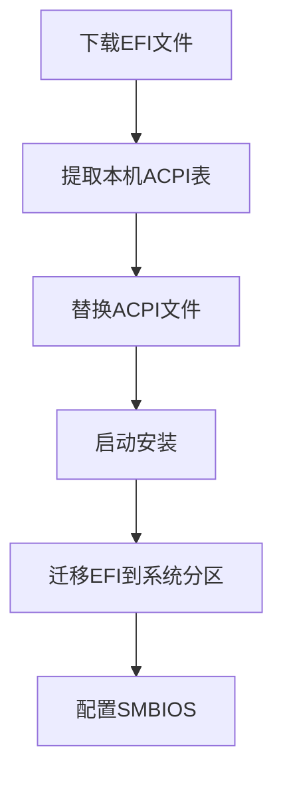

<div align="center">
  
  
  <h1>让 Windows 笔记本完美运行 macOS</h1>
  <small>
    <strong>简体中文</strong> |
    <a href="#繁體中文版">繁體中文</a> | 
    <a href="#english-version">English</a>
  </small>
  <p>为华硕 VivoBook FL8700JP (X509JP) 定制的黑苹果解决方案</p>
  
  <div>
    
    
    
  </div>
</div>

---

## 📚 目录导航

1. [🖥 项目结构](#-项目结构)
2. [💻 硬件支持](#-硬件支持)
3. [🖥️ 系统兼容](#️-系统兼容)
4. [⚙️ 安装指南](#️-安装指南)
5. [🛠️ 高级配置](#️-高级配置)
6. [❓ 常见问题](#-常见问题)
7. [⚠️ 重要提示](#️-重要提示)
8. [🤝 参与贡献](#-参与贡献)
---

## 🖥 项目结构

### EFI 配置文件结构

```bash
EFI/
├── BOOT/
│   └── BOOTx64.efi              # 引导文件
└── OC/
    ├── ACPI/                    # 系统补丁与修复
    │   ├── SSDT-AWAC.aml        # 时钟控制器修复
    │   ├── SSDT-EC-USBX.aml     # 嵌入式控制器
    │   └── SSDT-PLUG.aml        # CPU电源管理
    ├── Kexts/                   # 核心硬件驱动
    │   ├── Lilu.kext            # 核心插件
    │   ├── VirtualSMC.kext      # 系统管理控制器
    │   ├── WhateverGreen.kext   # 显卡修复
    │   └── AppleALC.kext        # 声卡驱动
    ├── Drivers/                 # OpenCore 引导驱动
    │   ├── OpenRuntime.efi      # 运行时服务
    │   └── HfsPlus.efi          # HFS+文件系统支持
    ├── config.plist             # 主配置文件
    └── Tools/                   # 实用工具集合
```

### ⚠️ 重要说明

- **专属适配**：仅适用于华硕 FL8700JP (X509JP) 特定机型  
- **系统准备**：需自行获取 macOS 安装镜像  
- **风险提示**：操作前请务必备份重要数据  
- **授权许可**：遵循 [MIT 许可证](LICENSE)，禁止商业用途  

---

## 📸 效果展示

<div align="center">
  
  
</div>

---

## 💻 硬件支持

| 组件         | 型号                      | 状态       | 详细说明               |
|--------------|---------------------------|------------|------------------------|
| **处理器**   | Intel i7-1065G7           | ✅ 完美支持 | Ice Lake 架构优化     |
| **核显**     | Intel Iris Plus G7        | ⚠️ 基本支持 | 不支持 HDMI 输出      |
| **独立显卡** | NVIDIA MX330              | ❌ 不支持   | 已在配置中屏蔽        |
| **音频**     | Realtek ALC256            | ✅ 完美支持 | 自动切换输入/输出设备 |
| **无线网络** | Intel Wireless-AC 9461    | ⚠️ 部分支持 | 不支持隔空投送       |
| **触控板**   | ELAN1200                  | ⚠️ 基本支持 | 偶发无响应            |
| **Type-C**   | -                         | ⚠️ 部分支持 | 不支持视频输出        |
| **蓝牙**     | Intel Bluetooth           | ✅ 完美支持 | 完整功能              |

---

## 🖥️ 系统兼容

| macOS 版本   | 兼容状态 | 最低要求版本 |
|--------------|----------|--------------|
| **Catalina** | ✅ 完美  | 10.15.4      |
| **Big Sur**  | ✅ 完美  | 11.0         |
| **Monterey** | ✅ 完美  | 12.0         |
| **Ventura**  | ✅ 完美  | 13.0         |
| **Sonoma**   | ✅ 完美  | 14.0         |
| **Sequoia**  | ✅ 完美  | 15.0         |
---

## ⚙️ 安装指南

### 准备工作

1. **BIOS 设置**：
   - 禁用 Secure Boot
   - 关闭 Fast Boot
   - 设置 DVMT 预分配为 64M

2. **安装介质**：
   - 下载 macOS 镜像（推荐[黑果小兵的部落阁](https://blog.daliansky.net/)）
   - 使用 [BalenaEtcher](https://www.balena.io/etcher/) 创建安装U盘

### 安装流程



### 详细步骤

1. **下载项目文件**  
   访问 [发布页面](https://github.com/bilijp153/ASUS-VivoBook-FL8700JP-Hackintosh/releases) 下载最新EFI

2. **提取本机 ACPI 表**  
   ```bash
   # 使用 SSDTTime 提取必要文件
   SSDTTime 提取 → FACP.aml → 重命名为 SSDT-FACP.aml
   ```

3. **替换配置文件**  
   将生成的SSDT文件放入 `EFI/OC/ACPI` 目录

4. **启动安装**  
   - 从U盘启动进入 OpenCore
   - 选择 "Install macOS XXX"
   - 按照屏幕提示完成安装

5. **迁移 EFI**  
   安装完成后，使用 [MountEFI](https://github.com/corpnewt/MountEFI) 工具将EFI迁移到系统分区

6. **SMBIOS 配置**  
   ```bash
   1. 使用 OCAuxiliaryTools 编辑 config.plist
   2. 设置机型为 MacBookPro16,2
   3. 生成三码并验证
   ```

---

## 🛠️ 高级配置

### 双系统安装 (BootCamp)


1. 从 [brigadier](https://github.com/corpnewt/brigadier) 获取 BootCamp 支持文件
2. 将生成的 BootCamp 文件夹复制到 Windows 系统盘
3. 修改 config.plist:
   ```xml
   <key>PlatformInfo</key>
   <dict>
     <key>updateSMBIOSMode</key>
     <string>Create</string>
   </dict>
   ```
4. 重启进入 Windows 并安装 BootCamp
5. 完成后恢复 updateSMBIOSMode 为 `Custom`

---

## ❓ 常见问题

<details>
<summary><strong>Q: 如何关闭开机时的"咚"声？</strong></summary>
<p>前往"系统设置" → "声音" → 取消勾选"启动时播放声音"</p>
</details>

<details>
<summary><strong>Q: 触控板偶尔无响应怎么办？</strong></summary>
<p>这是 ELAN1200 驱动的已知问题，暂时可通过以下方法解决：</p>
<ul>
  <li>重启系统</li>
  <li>进入睡眠模式后唤醒</li>
</ul>
</details>

<details>
<summary><strong>Q: 如何更改默认启动系统？</strong></summary>
<p>两种方法：</p>
<ol>
  <li>在 OpenCore 启动界面按 <code>Ctrl+Enter</code> 设置默认启动项</li>
  <li>进入 macOS 后通过"系统设置" → "启动磁盘"设置</li>
</ol>
</details>

<details>
<summary><strong>Q: 蓝牙设备无法连接？</strong></summary>
<p>尝试以下解决方案：</p>
<ul>
  <li>检查蓝牙是否正常驱动</li>
  <li>更新 新版本EFI</li>
  <li>检查是否为设备问题</li>
</ul>
</details>

---

## ⚠️ 重要提示

1. **首次设置**  
   在初始化界面跳过 Apple ID 登录，完成系统设置后再登录

2. **三码验证**  
   序列号在 [Apple 官网](https://checkcoverage.apple.com/) 应显示"无效序列号"状态

3. **安全登录**  
   完成上述步骤后再登录您的 Apple ID，避免账户异常

4. **系统更新**  
   每次进行 macOS 系统更新前：
   - 备份当前 EFI 分区
   - 检查项目更新日志
   - 等待社区确认兼容性

---

## 🤝 参与贡献

### 核心团队

| 角色       | 贡献者                     | 联系方式                |
|------------|----------------------------|-------------------------|
| 项目维护   | [极光呆呆脑](https://github.com/bilijp153) | 1551656605@qq.com      |
| 测试验证   | [若涵](https://github.com/catlingyun)    | - |

### 反馈渠道
- [提交 Issue](https://github.com/bilijp153/ASUS-VivoBook-FL8700JP-Hackintosh/issues)
- 发送邮件至: 1551656605@qq.com

---

## 🙏 特别鸣谢

- [OpenCore 官方指南](https://dortania.github.io/OpenCore-Install-Guide/) - 黑苹果安装的黄金标准
- [Acidanthera](https://github.com/acidanthera) - 提供核心驱动开发
- [laobamac](https://github.com/laobamac) - OCLP-Mod 开发者
- [Dortania 社区](https://dortania.github.io) - 技术支持与知识库
- [黑果小兵](https://blog.daliansky.net/) - 优质安装镜像资源

---

<div align="center">
  
📜 **许可证**: [MIT](LICENSE)  
© 2021-2025 极光呆呆脑 - 保留所有权利

> **温馨提示**：本项目仅用于学习和研究目的，使用 macOS 请遵守苹果公司相关协议

</div>
